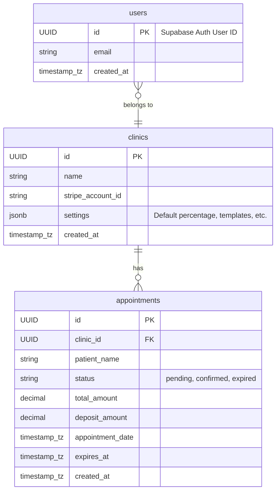
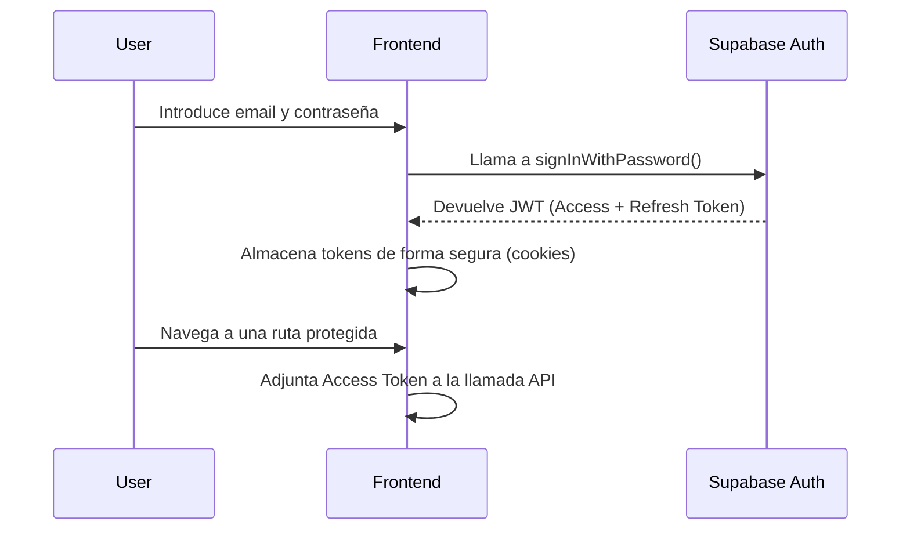

# SRS: CitaLink - Especificaciones de Arquitectura

**Producto:** CitaLink
**Tipo:** Software Requirements Specification (SRS) - Architecture
**Fecha:** 31 de Octubre de 2025

---

## 1. System Architecture

La arquitectura de CitaLink sigue un modelo moderno basado en Jamstack, utilizando Next.js como un framework full-stack y Supabase como Backend as a Service (BaaS). Esto permite un desarrollo rápido, escalabilidad y una excelente performance.

### Diagrama de Contexto (C4 - Nivel 1 y 2)

```mermaid
graph TD
    subgraph "CitaLink System"
        direction LR
        subgraph "Frontend (Vercel)"
            A[Next.js Web App]
        end

        subgraph "Backend (Vercel/Supabase)"
            B[Next.js API Routes]
            C[Supabase Edge Functions]
        end

        subgraph "Data & Auth (Supabase)"
            D[PostgreSQL Database]
            E[Supabase Auth]
        end
    end

    subgraph "External Services"
        F[Stripe API]
        G[Email Service]
    end

    User[Clínica / Paciente] -->|HTTPS| A
    A -->|API Calls (HTTPS)| B
    B -->|SDK Calls| D
    B -->|SDK Calls| E
    C -->|Webhook Callback| B
    B -->|API Calls| F
    F -->|Webhooks| C
    E -->|API Calls| G
```

**Flujo del Diagrama:**
1.  El **Usuario** (personal de la clínica o paciente) interactúa con la **Aplicación Web Next.js** desplegada en Vercel.
2.  El frontend realiza llamadas a las **API Routes de Next.js** para operaciones de negocio (ej. crear un CitaLink).
3.  Las API Routes utilizan el SDK de Supabase para interactuar con la **Base de Datos PostgreSQL** (para leer/escribir datos) y con **Supabase Auth** (para verificar la sesión del usuario).
4.  Para los pagos, las API Routes se comunican con la **API de Stripe**.
5.  Cuando un pago se completa, **Stripe** envía un webhook a una **Supabase Edge Function** dedicada.
6.  La Edge Function procesa el webhook y llama a una API Route interna para actualizar el estado de la cita en la base de datos.
7.  Servicios como el reseteo de contraseña o la verificación de email son gestionados por **Supabase Auth**, que a su vez utiliza un **Servicio de Email**.

---

## 2. Database Design

El diseño de la base de datos se centra en la simplicidad para el MVP, con tres entidades principales.

### Entity-Relationship Diagram (ERD)



**Nota Importante sobre el Schema:**
Este ERD es una representación conceptual. **NO se generará un schema SQL estático manualmente**. Se aprovechará la interfaz de Supabase y sus migraciones para gestionar la evolución del schema. El schema real y actualizado se puede obtener en tiempo real a través del **Supabase MCP (Management Control Plane)** o la CLI de Supabase.

---

## 3. Tech Stack Justification

*   **Framework Full-Stack: Next.js 15 (con App Router)**
    *   ✅ **Desarrollo Unificado:** Permite construir tanto el frontend como el backend en un único framework, simplificando el desarrollo y el despliegue.
    *   ✅ **Performance Optimizada:** Gracias a los React Server Components (RSC) y el renderizado estático/incremental, se logran tiempos de carga muy rápidos.
    *   ✅ **Ecosistema y Comunidad:** Amplio soporte, librerías y una comunidad muy activa.
    *   ❌ **Trade-off:** La curva de aprendizaje del App Router y los Server Components puede ser un desafío para desarrolladores que solo conocen el Pages Router o SPAs tradicionales.

*   **Backend as a Service (BaaS): Supabase**
    *   ✅ **Open Source y sin Vendor Lock-in:** Al estar basado en PostgreSQL, permite una migración futura a una infraestructura propia si fuera necesario.
    *   ✅ **Solución Integral:** Provee base de datos, autenticación, edge functions y almacenamiento en una única plataforma, acelerando enormemente el desarrollo.
    *   ✅ **Seguridad Incorporada:** Facilita la implementación de políticas de seguridad a nivel de fila (RLS), crucial para una aplicación multi-tenant.
    *   ❌ **Trade-off:** Aunque muy potente, es un ecosistema más joven que alternativas como Firebase. Algunas funcionalidades avanzadas pueden requerir más configuración manual.

*   **Plataforma de Despliegue: Vercel**
    *   ✅ **Integración Perfecta con Next.js:** Creado por el mismo equipo, ofrece la mejor experiencia de desarrollo y despliegue para Next.js.
    *   ✅ **CI/CD y Previews Automáticas:** Cada `git push` genera una preview desplegada, agilizando la revisión y el testing.
    *   ✅ **Escalabilidad Automática:** La infraestructura serverless escala automáticamente con el tráfico, sin necesidad de gestionar servidores.
    *   ❌ **Trade-off:** A gran escala, los costes pueden ser superiores a los de un proveedor cloud tradicional (AWS, GCP), aunque se compensa con el ahorro en tiempo de desarrollo y DevOps.

---

## 4. Data Flow: Creación de un CitaLink

Este es el flujo de datos para la operación más crítica del sistema.

1.  **User Action (Frontend):** Laura (recepcionista) rellena el formulario para crear un nuevo CitaLink y hace clic en "Generar Link".
2.  **Client-side Validation:** La aplicación Next.js valida los campos del formulario (ej. usando una librería como Zod) para dar feedback inmediato.
3.  **API Request:** Si la validación pasa, el cliente envía una petición `POST` a la API Route `/api/appointments` con los datos de la cita y el token de sesión (JWT) en las cabeceras.
4.  **Authentication (Backend):** La API Route utiliza un middleware para verificar el JWT con Supabase Auth y obtener el `user_id` y `clinic_id`.
5.  **Server-side Validation:** La API valida de nuevo los datos recibidos con Zod para asegurar la integridad.
6.  **Business Logic:** La API lee la configuración de la clínica desde la DB (ej. `% de anticipo`), calcula el `deposit_amount` y la fecha de expiración.
7.  **Database Write:** Se inserta un nuevo registro en la tabla `appointments` de Supabase con todos los datos y el estado `pending`.
8.  **API Response:** La API devuelve una respuesta `201 Created` con el objeto del appointment recién creado.
9.  **UI Update (Frontend):** El cliente recibe la respuesta, actualiza el estado de la UI para mostrar el nuevo CitaLink en el dashboard y presenta un botón para copiar el link.

---

## 5. Security Architecture

### Flujo de Autenticación (Login)



### Implementación de Autorización (RBAC)

*   **MVP (Basado en Propiedad):** La autorización se implementará exclusivamente con **Row Level Security (RLS)** de PostgreSQL en Supabase. Se crearán políticas que solo permitan a un usuario leer o escribir datos si su `clinic_id` (obtenido del JWT) coincide con el `clinic_id` de la fila a la que intenta acceder. Esto aísla eficazmente los datos de cada clínica.
*   **Futuro (Basado en Roles):** Para soportar múltiples usuarios por clínica, se creará una tabla intermedia `clinic_members` (`user_id`, `clinic_id`, `role`). Las políticas RLS se harán más complejas para consultar esta tabla y verificar si un usuario tiene el rol adecuado (`admin`, `member`) para realizar la operación.

### Protección de Datos

*   **Cifrado:** Como se indica en los NFRs, los datos están cifrados en tránsito (TLS 1.3 por Vercel) y en reposo (por Supabase).
*   **Sanitización de Entradas:** Todas las entradas del usuario serán validadas y sanitizadas en el servidor para prevenir ataques de XSS o inyección. El uso del cliente de Supabase previene por defecto inyecciones SQL.
*   **Gestión de Secretos:** Todas las claves de API y secretos del servidor (ej. `SUPABASE_SERVICE_KEY`, `STRIPE_SECRET_KEY`) se gestionarán como variables de entorno en Vercel, y nunca se expondrán en el lado del cliente.
